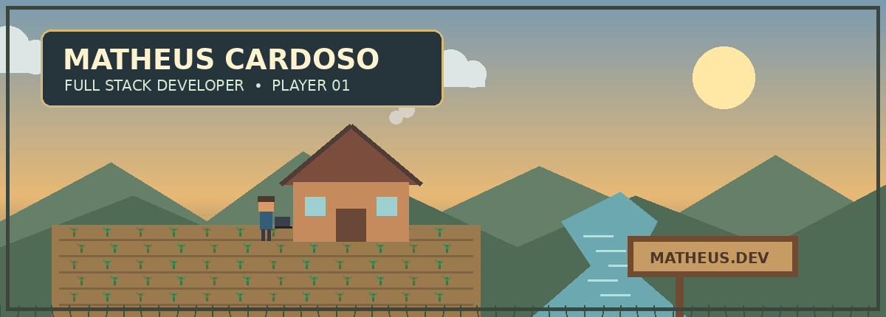
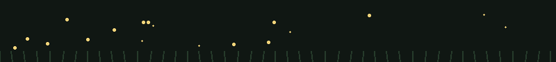

from PIL import Image, ImageDraw, ImageFont
from pathlib import Path
import zipfile, math, random, textwrap

base = Path("/mnt/data/github_profile_cozy")
assets = base / "assets"
assets.mkdir(parents=True, exist_ok=True)

# ---------- Fonts ----------
font_candidates = [
    "/usr/share/fonts/truetype/dejavu/DejaVuSans.ttf",
    "/usr/share/fonts/truetype/liberation2/LiberationSans-Regular.ttf",
]
font_bold_candidates = [
    "/usr/share/fonts/truetype/dejavu/DejaVuSans-Bold.ttf",
    "/usr/share/fonts/truetype/liberation2/LiberationSans-Bold.ttf",
]
font_path = next((p for p in font_candidates if Path(p).exists()), None)
font_bold_path = next((p for p in font_bold_candidates if Path(p).exists()), font_path)

def font(size, bold=False):
    return ImageFont.truetype(font_bold_path if bold else font_path, size)

# ---------- Animated pixel-art header ----------
W, H = 1200, 430
frames = []

random.seed(7)
stars = [(random.randrange(0, W), random.randrange(20, 180), random.choice([1,1,2])) for _ in range(55)]
clouds = [
    {"x": 120, "y": 70, "s": 1.0},
    {"x": 720, "y": 95, "s": 0.8},
]
fireflies = [(random.randrange(0, W), random.randrange(250, 390)) for _ in range(22)]

for f in range(24):
    im = Image.new("RGB", (W, H), "#7b9bb0")
    d = ImageDraw.Draw(im)

    # sky gradient bands
    for y in range(H):
        t = y / H
        if t < 0.62:
            c1 = (123, 155, 176)
            c2 = (232, 185, 117)
            u = t / 0.62
        else:
            c1 = (232, 185, 117)
            c2 = (73, 78, 88)
            u = (t - 0.62) / 0.38
        c = tuple(int(c1[i]*(1-u)+c2[i]*u) for i in range(3))
        d.line((0, y, W, y), fill=c)

    # sun
    sun_x = 980
    sun_y = 105 + int(8*math.sin(f/24*2*math.pi))
    d.ellipse((sun_x-42, sun_y-42, sun_x+42, sun_y+42), fill="#ffe8a6")

    # stars gradually appear
    night_alpha = max(0, (f-13)/10)
    if night_alpha > 0:
        for x,y,s in stars:
            if random.random() < night_alpha:
                d.rectangle((x,y,x+s,y+s), fill="#fff5c7")

    # clouds moving
    for ci, c in enumerate(clouds):
        x = (c["x"] + f*(1.2 if ci == 0 else -0.7)) % (W+220) - 110
        y = c["y"]
        s = c["s"]
        col = "#dbe6e5"
        for dx, dy, r in [(-42,8,22),(0,-5,30),(38,7,23)]:
            cx, cy = int(x+dx*s), int(y+dy*s)
            rr = int(r*s)
            d.ellipse((cx-rr,cy-rr,cx+rr,cy+rr), fill=col)
        d.rectangle((int(x-62*s), int(y+8*s), int(x+58*s), int(y+28*s)), fill=col)

    # distant hills
    d.polygon([(0,300),(150,220),(280,300),(410,205),(570,300),(730,225),(900,300),(1050,210),(1200,300),(1200,430),(0,430)],
              fill="#657f69")
    d.polygon([(0,335),(180,265),(340,335),(520,250),(700,335),(860,265),(1040,335),(1200,250),(1200,430),(0,430)],
              fill="#506b55")

    # river
    d.polygon([(720,430),(800,360),(760,300),(840,260),(890,300),(855,365),(930,430)], fill="#6ca8b0")
    for k in range(5):
        yy = 320 + k*20
        off = (f*3 + k*17) % 45
        d.line((790+off, yy, 830+off, yy), fill="#b9e1dc", width=3)

    # farm field
    d.rectangle((70,305,650,430), fill="#9b7a4e")
    for row in range(5):
        y = 325 + row*22
        d.line((80,y,640,y), fill="#806341", width=3)
        for col in range(12):
            x = 100 + col*45 + (row%2)*10
            # tiny crops
            d.line((x,y-5,x,y-15), fill="#3f7046", width=3)
            d.line((x,y-11,x-5,y-16), fill="#4f8753", width=2)
            d.line((x,y-11,x+5,y-16), fill="#4f8753", width=2)

    # house
    hx, hy = 475, 215
    d.polygon([(hx-95,hy+35),(hx,hy-45),(hx+95,hy+35)], fill="#7a4d3d")
    d.rectangle((hx-78,hy+32,hx+78,hy+112), fill="#c68b5c")
    d.rectangle((hx-20,hy+68,hx+20,hy+112), fill="#694838")
    d.rectangle((hx-62,hy+52,hx-35,hy+77), fill="#9fd0d1")
    d.rectangle((hx+35,hy+52,hx+62,hy+77), fill="#9fd0d1")
    # roof trim
    d.line((hx-95,hy+35,hx,hy-45,hx+95,hy+35), fill="#4e3c36", width=7)

    # chimney smoke
    smoke_y = hy-65 - (f*3 % 35)
    d.ellipse((hx+52, smoke_y, hx+70, smoke_y+18), fill="#d6d1c4")
    d.ellipse((hx+65, smoke_y-12, hx+86, smoke_y+9), fill="#d6d1c4")

    # sign
    d.rectangle((850,320,1080,375), fill="#704b32")
    d.rectangle((858,328,1072,367), fill="#c79b64")
    d.text((880,338), "MATHEUS.DEV", font=font(20, True), fill="#4d3828")
    d.rectangle((915,375,925,430), fill="#704b32")

    # little character walking / working
    char_x = 360 + int(10*math.sin(f/24*2*math.pi))
    char_y = 286
    # body
    d.rectangle((char_x-8,char_y,char_x+8,char_y+25), fill="#355d77")
    # head
    d.rectangle((char_x-10,char_y-18,char_x+10,char_y), fill="#d89a6a")
    # hair
    d.rectangle((char_x-11,char_y-20,char_x+11,char_y-13), fill="#4b382f")
    # legs
    step = 3 if (f//3)%2==0 else -3
    d.line((char_x-4,char_y+25,char_x-7+step,char_y+40), fill="#3f3a38", width=5)
    d.line((char_x+4,char_y+25,char_x+7-step,char_y+40), fill="#3f3a38", width=5)
    # laptop
    d.rectangle((char_x+12,char_y+8,char_x+32,char_y+22), fill="#38414a")
    d.line((char_x+12,char_y+22,char_x+35,char_y+22), fill="#20262b", width=3)

    # foreground grass
    for x in range(0, W, 24):
        sway = int(3*math.sin((x+f*3)/18))
        d.line((x,430,x+sway,414), fill="#38543d", width=2)

    # title plate
    d.rounded_rectangle((55,40,600,145), radius=14, fill="#26343c", outline="#d6b879", width=3)
    d.text((85,58), "MATHEUS CARDOSO", font=font(38, True), fill="#fff2cf")
    d.text((87,104), "FULL STACK DEVELOPER  •  PLAYER 01", font=font(20, False), fill="#d8e8d4")

    # vignette-ish border
    d.rectangle((8,8,W-9,H-9), outline="#3b463f", width=5)

    frames.append(im)

gif_path = assets / "cozy-header.gif"
frames[0].save(gif_path, save_all=True, append_images=frames[1:], duration=120, loop=0, optimize=True)

# ---------- Small animated fireflies GIF ----------
fw, fh = 800, 90
fframes = []
pts = [(random.randrange(15, fw-15), random.randrange(18, fh-18), random.random()*6.28) for _ in range(18)]
for f in range(16):
    im = Image.new("RGB", (fw, fh), "#101713")
    d = ImageDraw.Draw(im)
    d.rectangle((0,0,fw,fh), fill="#101713")
    for x,y,p in pts:
        glow = (math.sin(f/16*2*math.pi+p)+1)/2
        r = 1 + int(glow*2)
        d.ellipse((x-r,y-r,x+r,y+r), fill="#f2d47a")
    # grass silhouettes
    for x in range(0, fw, 18):
        d.line((x,fh,x+int(3*math.sin(x)),fh-16), fill="#263b2b", width=2)
    fframes.append(im)
firefly_path = assets / "fireflies.gif"
fframes[0].save(firefly_path, save_all=True, append_images=fframes[1:], duration=140, loop=0, optimize=True)

# ---------- README ----------
readme = r'''

 

### 🌱 Welcome to my little corner of the internet.

**Full Stack Developer · Builder · Problem Solver**

 

---

## 🏡 About the Developer

> **Hi, I'm Matheus.**
>
> I build web applications, systems and interfaces with a focus on turning ideas into software that actually works.
>
> I enjoy learning by building, solving annoying bugs, improving interfaces and shipping things that people can use.

`BUILD` · `LEARN` · `SHIP` · `REPEAT`

---

## 🎒 Inventory

<table>
<tr>
<td align="center" width="20%"><b>🐘</b> PHP</td>
<td align="center" width="20%"><b>🍰</b> CakePHP</td>
<td align="center" width="20%"><b>⚡</b> JavaScript</td>
<td align="center" width="20%"><b>🗄️</b> MySQL</td>
<td align="center" width="20%"><b>🐳</b> Docker</td>
</tr>
<tr>
<td align="center"><b>🌐</b> HTML / CSS</td>
<td align="center"><b>🔌</b> REST APIs</td>
<td align="center"><b>🐧</b> Linux</td>
<td align="center"><b>🔧</b> Git</td>
<td align="center"><b>🎨</b> UI / UX</td>
</tr>
</table>

---

## 📜 Current Quest

<table>
<tr>
<td width="75%">

### 🛠️ Conforseg — System Evolution

Building and improving a real-world web platform focused on occupational safety.

**Stack:** PHP · CakePHP · JavaScript · MySQL · Docker

**Status:** `IN PROGRESS`

</td>
<td align="center">

🌱 
**GROWING**

</td>
</tr>
</table>

---

## 🗺️ Project Board

<table>
<tr>
<td width="50%">

### 🛡️ CONFORSEG
**ACTIVE**

A web platform for occupational safety management.

- Dashboards
- Questionnaires
- Reports
- Denunciation channel
- Company & user management
- Modern interfaces

`PHP` `CakePHP` `JavaScript` `MySQL`

</td>
<td width="50%">

### 🧪 EXPERIMENT LAB
**ONGOING**

A place for experiments, UI ideas, prototypes and whatever interesting problem shows up next.

`WEB` `UI/UX` `APIs` `AUTOMATION`

</td>
</tr>
</table>

---

## 🏆 Achievements

| 🌱 | Achievement | Description |
|---|---|---|
| 🏡 | **FIRST PROJECT** | Started building instead of only learning. |
| 🐛 | **BUG HUNTER** | Survived bugs that had absolutely no business existing. |
| 🚀 | **SHIPPED** | Turned an idea into working software. |
| 🔥 | **PRODUCTION SURVIVOR** | Deployed code and lived to tell the story. |

---

### 🌅 Thanks for visiting.

*See you on the next quest.*

'''

readme_path = base / "README.md"
readme_path.write_text(readme, encoding="utf-8")

# ---------- Zip ----------
zip_path = Path("/mnt/data/matheus-github-profile-cozy.zip")
with zipfile.ZipFile(zip_path, "w", zipfile.ZIP_DEFLATED) as z:
    z.write(readme_path, "README.md")
    z.write(gif_path, "assets/cozy-header.gif")
    z.write(firefly_path, "assets/fireflies.gif")

print(f"Created: {readme_path}")
print(f"Created: {gif_path}")
print(f"Created: {firefly_path}")
print(f"Bundle: {zip_path}")
